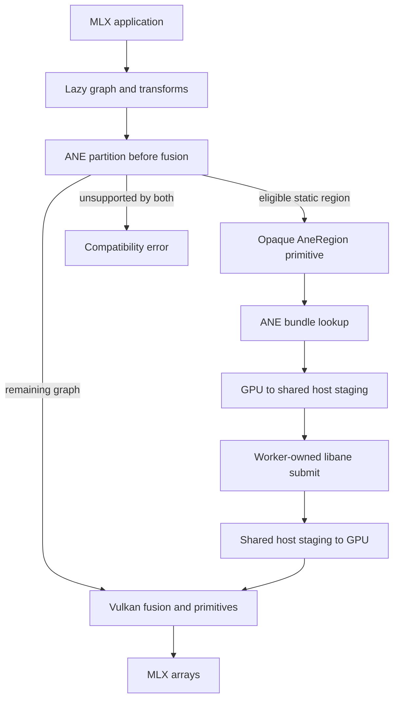

# Architecture

## Goal

Existing MLX Python and C++ graph code must run on M1 Linux without a Metal layer.
The Omarchy GPU provides the full tensor backend through Vulkan.
The ANE can replace supported static graph regions after numerical and performance gates pass.

The CPU may schedule commands, copy buffers, tokenize input, and serve requests.
It must not evaluate tensor primitives in a release build.

## Backend boundary

MLX exposes `DeviceType::cpu` and `DeviceType::gpu`.
It also selects complete GPU backends at build time.
Metal and CUDA each implement the `mlx::core::gpu` namespace and primitive `eval_gpu` methods.
MLX does not expose an external GPU plug-in API.

`mlx-omarchy` will add `MLX_BUILD_OMARCHY` and implement the same internal GPU boundary.
Applications will keep `mx.gpu`.
ANE selection stays inside the Linux GPU evaluator and runs before compiled-fusion lowering.
Each release records its exact upstream MLX tag and commit.
The runtime, primitive, and semantic gates rerun after every baseline change.

## Vulkan backend

The Vulkan backend owns these responsibilities:

- Honeykrisp device discovery and capability checks
- Host-visible unified-memory allocation
- MLX streams, events, command buffers, queues, and fences
- Copies, views, aliasing, and lifetime rules
- SPIR-V kernels for each `eval_gpu` primitive
- Matmul and quantized matmul kernels
- Runtime fusion compilation and a content-addressed shader cache
- Backend traces that name each primitive and execution device

M1 Vulkan reports FP16 support but lacks native BF16, FP4, integer dot-product, and matrix-core operations.
The backend must implement MLX storage and arithmetic semantics with Vulkan packing and conversion.
A missing native format does not permit CPU fallback.

## ANE integration

ANE integration starts after the `v0.5.0` Vulkan compatibility release.
It also requires the corrected 13-layer Qwen graph and 11-layer tail to pass on Linux.

The partitioner uses an exact capability key:

- operation sequence
- dtype and quantization
- static shape and layout
- input, output, state, and workspace contracts
- graph and descriptor hashes
- compiler and firmware identifiers
- measured transfer and execution cost

ANE compilation must run on Linux without private Apple frameworks. Reuse an open-source compiler rather than require a Mac export service. The preserved maderix MIL-to-HWX compiler generates new HWX objects for H16G/M4; making its host tools run on Linux does not establish M1 target support.

First compile a supported single operation on Linux, then validate its target-specific output and execute it through the bounded M1 worker. General MLX lowering follows that proof. The compiler and HWX-to-ANEC path must preserve graph identity, tensor bindings, target, toolchain provenance, and payload hashes. The bundle schema must record host-neutral compiler identity instead of requiring a macOS build. GitHub release assets may cache qualified bundles, but creating them must not require a Mac.
Linux rejects a bundle before device access if any contract field differs.
A missing bundle keeps only the affected region on Vulkan.

Current `libane` buffer objects expose host mappings but no PRIME or dma-buf API.
The first hybrid path uses explicit Vulkan-to-host-to-ANE staging with fences and cache maintenance.
The ANE worker owns the device file descriptor and resident buffer objects.
The evaluator and worker exchange shared host staging buffers.
Every crossover result includes both copy and process IPC cost.
Direct sharing can replace staging only after isolated export, import, coherency, synchronization, and recovery tests pass.
dma-buf code stays disabled as probe-only scaffolding until those tests pass.
Eligible recurrent state buffers keep stable worker-owned ANE identities across decode evaluations.
The runtime rebinds per-step inputs and tears down residency after a graph, shape, or stream change.
The partitioner runs before `mx.compile` fusion.
It replaces selected regions with opaque `AneRegion` primitives and fuses the remaining graph for Vulkan.

## Failure rules

- An ANE-ineligible region stays on Vulkan.
- A primitive unsupported by Vulkan and ANE returns its name, dtype, and shape.
- A Vulkan timeout returns a bounded error and must leave the device usable for the next process.
- An ANE timeout returns a bounded worker error and starts the documented reboot and bring-up procedure.
- A failed submit must not trigger CPU tensor evaluation.
- A failed ANE submit must not corrupt its source Vulkan buffers.
- Hardware testing stops until the ANE self-test passes after recovery.

## Boot and device tree

The kernel does not read a device tree out of `/boot`.
m1n1 patches the packaged dtb with per-boot values, and `update-m1n1`
bakes the dtbs into the ESP payload.
Replacing the whole tree discards those live values, and on this project's
M1 that left seven of eight cores offline.

See [`boot-and-kernel.md`](boot-and-kernel.md) for the chain, the
requirements for an Omarchy kernel that carries the ANE node, and the
verification commands that prove a node reached the kernel.

## Repository ownership

- `mlx-omarchy` owns the downstream MLX patch set, Omarchy backend, ANE partitioner, packaging, tests, and releases.
- `ane-linux-experiments` owns hardware probes, format research, fixtures, and evidence before interfaces stabilize.
- `eiln/ane` is the upstream of the Linux ANE DRM driver and `libane` ABI.

Do not copy driver code into `mlx-omarchy`.
Prove a driver change in the experiment repository first.

Owner decision, 2026-09-03: driver, `libane`, and MLX changes are **not**
sent upstream. We maintain our own forks, backport upstream into them,
and add our fixes there, so no work waits on upstream review. Whether to
offer any of it upstream later is a separate, deferred decision.

The forks are `joshuaswarren/omarchy-mlx` (upstream `ml-explore/mlx`) and
`joshuaswarren/omarchy-ane`, which carries both the driver and `libane`
because `allbilly/libane` is a fork ahead of `eiln/ane` and GitHub allows
one repository per account per fork network. A prepared six-commit
`libane` series is kept as patches at `~/keep/eiln-ane-series/` and
inlined in `receipts/2026-09-01-libane-upstream-prep.md`; it is not to be
opened as a pull request.

Forking does not relax the rule above: driver code lives in the fork, not
vendored into this repository.
The fork map and the backport flow are in [`forks.md`](forks.md).
