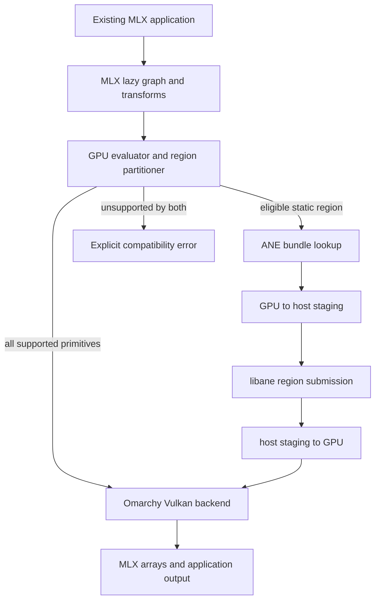

# MLX on Omarchy GPU and ANE - Plan

## Goal Capsule

- **Objective:** Existing MLX models and engines run on M1 Omarchy through Vulkan, with at least one representative region accelerated by ANE.
- **Means:** Maintain a pinned downstream MLX patch set with a Vulkan GPU backend and internal ANE graph acceleration. (KTD1, KTD2, KTD3)
- **Authority:** The Product Contract governs behavior. The Key Technical Decisions govern implementation within that contract.
- **Execution profile:** Release each Vulkan layer separately. Start ANE work only after the Vulkan compatibility release.
- **Stop conditions:** Stop a release on incorrect results, CPU tensor fallback, GPU reset, kernel fault, or an unrecoverable ANE submission.
- **Tail ownership:** Publish installable wheels, hardware test receipts, compatibility results, and usable MLX command-line programs.

---

## Product Contract

### Summary

Build Linux MLX compatibility for Apple Silicon without Metal emulation.
The Omarchy GPU supplies the complete tensor baseline through Vulkan.
The ANE accelerates supported static graph regions after the Linux ANE runtime proves full-graph parity.
The public result must run existing MLX programs, not only custom research probes.
The target user needs the MLX ecosystem: models, transforms, automatic differentiation, fine-tuning, and source-compatible engines.
`llama.cpp` is the same-machine performance comparator, not a replacement for these MLX capabilities.

### Problem Frame

MLX currently selects CPU, CUDA, or Metal backends at build time.
Its public device model exposes `mx.cpu` and `mx.gpu`, but it has no external backend plug-in interface.
Linux on M1 exposes the Apple GPU through Honeykrisp Vulkan and Rusticl OpenCL.
It does not expose Metal.

The current repository proves real Linux ANE execution, including production task graphs and Qwen-shaped kernels.
It does not yet prove a complete Qwen token path on ANE.
The corrected 13-layer graph still needs a run with workspace buffer 3 before the 11-layer tail can connect.

### Key Decisions

- **GPU and ANE own tensor compute.** CPU may schedule, copy, tokenize, and serve requests. It may not run tensor kernels. Governs R1, R4, R5, R6, R7. (session-settled: user-directed — chosen over MLX CPU fallback: the Linux port must use Apple accelerators)
- **Keep standard MLX source compatibility.** Existing model code keeps `import mlx.core as mx` and `mx.gpu`. Governs R1, R2, R3.
- **Ship one new repository.** Keep the Linux patch set, integration code, packages, and user documentation in `mlx-omarchy`. Fetch pinned MLX source during builds. Keep ANE experiments in their existing repository, and send driver changes to `eiln/ane`. Governs R12, R15, R19.

### Requirements

**MLX compatibility**

- R1. Existing MLX Python models must run without model graph rewrites and must keep the `mlx` import path.
- R2. macOS MLX engines must port through platform and package changes, not model-specific rewrites.
- R3. Linux must keep `mx.gpu` as the public accelerator device and treat ANE offload as an internal execution choice.
- R4. The port must preserve MLX lazy evaluation, streams, transforms, automatic differentiation, compilation, shape, and error semantics for its supported operation and dtype matrix.

**Accelerator execution**

- R5. The Honeykrisp Vulkan backend must provide complete tensor execution when ANE offload is disabled.
- R6. The ANE backend must execute only regions that pass capability, shape, artifact, and cost checks.
- R7. An ANE-ineligible region must execute on Vulkan, while a primitive unsupported by both accelerators must fail with its name and dtype.
- R8. The runtime must expose backend traces that prove no tensor primitive executed on CPU.

**Artifacts and interoperation**

- R9. ANE graphs must compile on Linux through an open-source compiler. Building or using the Linux ANE path must not require a Mac or private Apple compiler. macOS may provide independent numerical and performance references.
- R10. Every ANE bundle must record graph metadata, tensor contracts, compiler and firmware identifiers, hashes, and source provenance.
- R11. GPU-to-ANE transfers must use measured host staging until the DRM driver and Vulkan stack prove safe dma-buf sharing.
- R19. Release bundles must ship as separate public assets keyed by model, shapes, compiler, firmware, and graph hash. Unsupported or missing bundles must leave the affected region on Vulkan.

**Packaging and useful programs**

- R12. A clean M1 Omarchy install must produce an `mlx-omarchy` wheel whose installed Python module is `mlx`.
- R13. `mlx_lm.generate` and `mlx_lm.server` must run as the first public binary workflows.
- R14. The compatibility program must then cover MLX Whisper, MLX-VLM, MLX-Audio, `mlx-openai-server`, `mlx-serve`, and `mlxcel` without project-specific compute backends.
- R15. Public releases must include source, an MIT license, install steps, a compatibility matrix, known limits, and hardware receipts.

**Safety and recovery**

- R16. A failed Vulkan submission must return a bounded error and leave the device usable for the next process.
- R17. Hardware tests must detect GPU resets, ANE timeouts, memory growth, and stale synchronization before release.
- R18. The repository must not redistribute Apple private frameworks, compiler binaries, firmware, or model weights.
- R20. ANE tests must isolate submissions in a worker process and record the required reboot and bring-up recovery until the driver supports process-grade recovery.

### Acceptance Examples

- AE1. **Unmodified MLX-LM generation**
  - **Covers:** R1, R3, R4, R5, R8, R12, R13
  - **Given:** The Linux build has the CPU tensor backend disabled and ANE offload disabled.
  - **When:** A user runs `mlx_lm.generate` with `Qwen3.8-2B-Q4_K_M.gguf`, SHA-256 `4aa0fb13c431514262f259d420ecc95a8714df58ac2a2384514e20b93983f0ff`.
  - **Then:** The model generates the reference greedy tokens, and the trace contains only Vulkan tensor work.

- AE2. **No silent fallback**
  - **Covers:** R7, R8
  - **Given:** A graph contains a primitive that the Vulkan and ANE backends do not support.
  - **When:** MLX evaluates the graph.
  - **Then:** Evaluation fails with the primitive, dtype, and shape instead of invoking a CPU tensor kernel.

- AE3. **ANE region offload**
  - **Covers:** R6, R7, R9, R10, R11
  - **Given:** A graph contains an eligible static region with a matching ANE bundle.
  - **When:** MLX evaluates the graph with ANE offload enabled.
  - **Then:** The trace shows Vulkan, a bounded transfer, one ANE region submission, and Vulkan continuation with matching outputs.

- AE4. **Source-compatible engine port**
  - **Covers:** R1, R2, R12
  - **Given:** An engine imports the public MLX Python or C++ API and has no direct Metal calls.
  - **When:** The maintainer installs `mlx-omarchy` and rebuilds platform packaging.
  - **Then:** The same graph code runs on `mx.gpu` without a Linux-only model implementation.

- AE5. **Clean-machine use**
  - **Covers:** R12, R13, R15, R18
  - **Given:** A supported M1 Omarchy machine has the documented kernel and Mesa packages.
  - **When:** A user follows the published install and smoke procedure.
  - **Then:** The wheel installs, `mlx_lm.generate` runs, and the receipt identifies every installed component.

### Success Criteria

- The MLX upstream Python and C++ tests pass for the supported M1 operation and dtype matrix.
- `docs/compatibility.md` lists every excluded upstream CPU-stream-only operation and dtype with its named no-CPU error.
- The CPU tensor backend is absent from release builds and hardware traces report zero CPU primitive dispatches.
- Fixed prompts produce the same first 32 greedy tokens as the pinned macOS MLX reference for `Qwen3.8-2B-Q4_K_M.gguf`, SHA-256 `4aa0fb13c431514262f259d420ecc95a8714df58ac2a2384514e20b93983f0ff`.
- Other qualified models meet their pinned numerical tolerance and fixture-specific argmax or top-k contract.
- Vulkan MLX-LM `pp512` and `tg128` each reach at least 80 percent of the pinned `llama.cpp` Vulkan reference.
- ANE offload remains disabled for a workload unless its median total latency improves by at least 10 percent without changing accepted output.
- At least one representative MLX region passes the ANE bundle, parity, safety, and crossover gates.
- One hundred repeated generation requests complete without a GPU reset, ANE timeout, or device loss. After warmup, final memory stays within 2 percent or 16 MiB of baseline, whichever is larger.
- Publish a GitHub release after U2, U2b, U3, U4, and U5. Publish the first ANE-enabled release only after U1, U6, U9, and U7.
- The U5 Vulkan compatibility release is useful without ANE, but it does not complete this hybrid plan.

### Scope Boundaries

**Included**

- M1 Apple Silicon on Omarchy Linux.
- MLX Python and C++ source compatibility.
- Vulkan tensor execution and ANE region acceleration.
- Inference, training primitives, transforms, and automatic differentiation required by the upstream compatibility suite.
- Public wheels, command-line programs, server workflows, and hardware receipts.

**Deferred until the M1 contract passes**

- M2, M3, and M4 device qualification.
- Zero-copy GPU-to-ANE sharing.
- Separate product repositories for servers, audio, vision, or desktop applications.

**Excluded**

- Metal emulation on Linux.
- A public `mx.ane` device that requires applications to partition their own graphs.
- CPU tensor fallback hidden behind compatibility behavior.
- Redistribution of Apple private software or third-party model weights.
- Upstream CPU-stream-only operations and dtypes without Vulkan implementations. Initial exclusions include `mx.linalg.svd`, `mx.linalg.qr`, `mx.linalg.inv`, `mx.linalg.pinv`, `float64`, and complex dtypes. Each exclusion must return a named compatibility error.

### Dependencies

- The target M1 Omarchy kernel, Mesa Honeykrisp Vulkan driver, Vulkan loader, and shader compiler.
- The out-of-tree ANE DRM driver and `libane` work in `eiln/ane`.
- A pinned open-source ANE compiler, its Linux build dependencies, and a separately qualified M1 target backend.
- Upstream MLX source and its existing CPU, CUDA, Metal, and no-backend implementations.

---

## Planning Contract

### Key Technical Decisions

- KTD1. **Maintain a patch set against a pinned MLX baseline.** MLX selects complete GPU backends at compile time and has no external GPU plug-in boundary. `mlx-omarchy` records an upstream tag, commit, archive URL, and SHA-256. Its build fetches MLX into an ignored directory and applies the Linux patch set. Every baseline change reruns U2 through U4. This implements R1 through R5.
- KTD2. **Use Vulkan as the GPU API.** Honeykrisp already exposes Vulkan 1.3 on the target and supports Linux external-memory paths needed for future dma-buf work. OpenCL would create a second kernel stack without improving ANE interoperation. This implements R5 and R11.
- KTD3. **Keep ANE behind `mx.gpu` and preserve state across evaluations.** The graph evaluator will select ANE regions inside normal GPU evaluation. It will keep stable ANE buffer identities for recurrent state, rebind per-step inputs, and invalidate residency on shape, graph, or stream changes. Applications will not manage an ANE device. This implements R3, R6, and R7.
- KTD4. **Compile out CPU tensor execution in release builds.** Host code may schedule and copy, but missing accelerator support is an error. Tests will run a release-equivalent no-CPU build. This implements R4, R7, and R8.
- KTD5. **Start with host-staged GPU-to-ANE copies.** Current `libane` buffer objects expose CPU mappings but no PRIME or dma-buf API. Direct sharing can replace staging only after export, import, cache-coherency, and fence probes pass. dma-buf work remains disabled probe-only scaffolding until then. This implements R11, R16, R17, and R20.
- KTD6. **Compile supported MLX regions on Linux.** Reuse the open-source MIL-to-HWX compiler pipeline, provide a Linux host build, and qualify M1 code generation independently from the existing H16G/M4 target. Lower supported MLX regions into the compiler IR, emit target-specific HWX, convert to ANEC, and retain the versioned bundle contract. Compiler metadata must name the toolchain, source revision, build host, and target without requiring macOS fields. This implements R9, R10, and R18.
- KTD7. **Emulate missing dtypes on Vulkan.** The M1 Vulkan capability report has FP16 but lacks native BF16, FP4, integer dot-product, and matrix-core operations. Shaders must preserve MLX semantics through packing and conversion rather than CPU fallback. This implements R4, R5, and R7.
- KTD8. **Keep the repository set small.** `mlx-omarchy` owns the Linux patch set, integration, packaging, and release docs. `ane-linux-experiments` remains the hardware evidence lab. Driver ABI changes belong in `eiln/ane`. This implements R12 and R15.
- KTD9. **Gate products through existing projects.** MLX-LM is the first executable gate. The later matrix uses established MLX projects and native engine ports instead of custom demo applications. This implements R13 and R14.
- KTD10. **Distribute ANE bundles outside the wheel.** GitHub release assets will carry bundles for named models and shape sets. The release manifest will map exact compiler and firmware identifiers to asset hashes. The public exporter and contribution guide will define community bundle submission. A missing asset uses Vulkan. This implements R19.

### High-Level Technical Design

The Vulkan backend defines MLX's complete `gpu` namespace for Linux Omarchy builds.
It owns device discovery, unified-memory allocation, command buffers, streams, events, fences, primitive shaders, and compiled-fusion shaders.

The ANE partitioner inspects the graph before compiled-fusion lowering.
It replaces selected regions with opaque `AneRegion` primitives, then sends the remaining graph through Vulkan fusion.
It uses an exact capability registry keyed by operation, dtype, shape, layout, artifact version, and measured crossover.
The ANE worker owns the device file descriptor and resident buffer objects.
The evaluator and worker exchange shared host staging buffers, and crossover measurements include this IPC cost.
The worker preserves eligible recurrent state buffers across evaluations and rebinds only per-step inputs.
It tears down residency on graph, shape, or stream changes.
Everything else stays in the Vulkan graph.

On Linux, the compiler lowers supported MLX regions into its typed IR and emits target-specific code without private Apple frameworks. A Linux host build that emits H16G/M4 code is not an M1 execution proof. The target backend, HWX-to-ANEC conversion, manifest, and worker must pass one connected M1 numerical gate.

### Sequencing

1. Complete the current full Qwen ANE parity experiment and freeze the buffer contract.
2. Build the Vulkan runtime, then run an early matmul and attention performance spike against the pinned `llama.cpp` build before broad primitive expansion.
3. Pass MLX core semantics and MLX-LM on Vulkan before adding ANE to the evaluator.
4. Add the Linux compiler and ANE worker behind a disabled-by-default capability flag; qualify M1 code generation before enabling it.
5. Enable ANE regions only after parity, safety, and measured crossover gates pass.
6. Qualify ecosystem projects and publish the first supported release.

### System-Wide Impact

- **MLX evaluator:** A new compile-time GPU backend and internal region partitioner affect graph evaluation, streams, and errors.
- **Memory ownership:** Vulkan and ANE require explicit ownership transitions, cache maintenance, and fence rules.
- **Packaging:** The wheel must replace upstream `mlx` cleanly and reject incompatible simultaneous installs.
- **State residency:** Recurrent ANE buffers outlive one MLX evaluation and require explicit invalidation on graph, shape, and stream changes.
- **Kernel boundary:** dma-buf work is disabled probe-only scaffolding for deferred zero-copy. A stable API can land upstream only after the capability gate passes.
- **Compatibility:** Each upstream MLX update can add primitives, dtypes, transforms, or generated kernels that need Omarchy coverage.

### Risks and Controls

- **ANE full-graph parity is not complete.** Keep U6 and U7 blocked until U1 proves the corrected 13-layer graph and connected 11-layer tail.
- **Vulkan lacks native MLX dtype features on M1.** KTD7 requires conformance tests for every emulated dtype path.
- **Compiled fusion may need runtime shader generation.** Start with the smallest GLSL-to-SPIR-V path that preserves MLX compile semantics and cache compiled modules by graph hash.
- **GPU-to-ANE copies can erase ANE gains.** KTD5 requires a measured crossover table before each region enters the default allowlist.
- **Kernel faults can lose the machine.** Isolate ANE submits in a worker process. Record the required reboot and bring-up sequence until `eiln/ane` proves process-grade recovery.

### Research Sources

- MLX device model: `https://github.com/ml-explore/mlx/blob/main/mlx/device.h`
- MLX primitive contract: `https://github.com/ml-explore/mlx/blob/main/mlx/primitive.h`
- MLX GPU evaluator: `https://github.com/ml-explore/mlx/blob/main/mlx/backend/gpu/eval.h`
- MLX build selection: `https://github.com/ml-explore/mlx/blob/main/CMakeLists.txt`
- MLX custom extension model: `https://ml-explore.github.io/mlx/build/html/dev/extensions.html`
- ANE Linux driver and runtime: `https://github.com/eiln/ane`
- MLX-LM: `https://github.com/ml-explore/mlx-lm`
- MLX examples, including Whisper: `https://github.com/ml-explore/mlx-examples`
- MLX-VLM: `https://github.com/Blaizzy/mlx-vlm`
- MLX-Audio: `https://github.com/Blaizzy/mlx-audio`
- OpenAI-compatible MLX server: `https://github.com/cubist38/mlx-openai-server`
- Native MLX server: `https://github.com/ddalcu/mlx-serve`
- Rust MLX engine and server: `https://github.com/lablup/mlxcel`

---

## Implementation Units

### Release cadence

Each unit below is a bounded release. A later unit starts only after the prior tag and M1 receipt are public.

| Release | Scope | Required public evidence |
| --- | --- | --- |
| `v0.1.0` | U2 Vulkan runtime core | Source release, runtime tests, trace smoke |
| `v0.2.0` | U2b Vulkan kernel baseline | Matched kernel gate and balanced M1 receipts |
| `v0.3.0` | U3 Vulkan primitives and dtypes | Primitive suite, compatibility matrix, no-CPU trace |
| `v0.4.0` | U4 transforms, compilation, and autograd | Conformance suite and compiled-graph trace |
| `v0.5.0` | U5 installable Vulkan compatibility | Wheel, clean install, MLX-LM generation and server smoke |
| `v0.6.0` | U1, U6, U9, and U7 ANE integration | ANE parity, bundle, driver, partition, and recovery receipts |

ANE work follows `v0.5.0`. It does not block the five Vulkan releases.

### U1. Close the Linux ANE full-graph parity gate

- **Goal:** Prove the complete Qwen token path before MLX can select ANE regions.
- **Requirements:** R6, R9, R10, R17, R20
- **Repository:** `ane-linux-experiments`
- **Files:** `tools/production-anec-probe.py`, `tools/production-anec-sequential.py`, `tools/test_production_anec_probe.py`, `docs/progress.md`, `THEORY.MD`
- **Approach:** Run the corrected 13-layer graph with workspace buffer 3. Map its state and output tensors into the 11-layer tail. Compare each boundary against the macOS and host references. Record the exact descriptor, buffer, firmware, and graph hashes.
- **Test scenarios:**
  - The 13-layer graph runs with the production buffer roles `workspace=3`, `destination=4`, and `source=5`.
  - The 11-layer tail consumes the saved state and output without host tensor recomputation.
  - The connected path matches reference tensor tolerances, argmax, top-10 ordering, and fixed greedy tokens.
  - A wrong workspace, tensor shape, or artifact hash fails before submission.
  - A timed-out submit returns control to the worker. The receipt records reboot and bring-up recovery, and testing stops until the ANE self-test passes.
- **Verification:** `python -m pytest tools/test_hwxv2_to_anec.py tools/test_production_anec_probe.py`, then the recorded M1 hardware probe for the connected graph.
- **Dependencies:** The `v0.5.0` Vulkan compatibility release.

### U2. Add the Omarchy Vulkan runtime core

- **Goal:** Make MLX allocate, schedule, synchronize, and copy arrays through Honeykrisp Vulkan.
- **Requirements:** R3, R4, R5, R7, R8, R16
- **Repository:** `mlx-omarchy`
- **Files:** `CMakeLists.txt`, `mlx/backend/omarchy/allocator.cpp`, `mlx/backend/omarchy/device.cpp`, `mlx/backend/omarchy/eval.cpp`, `mlx/backend/omarchy/event.cpp`, `mlx/backend/omarchy/stream.cpp`, `mlx/backend/omarchy/vulkan.h`, `tools/mlx-omarchy-info/`, `tests/omarchy/test_runtime.cpp`
- **Patterns:** Follow the full backend boundary in `mlx/backend/cuda/` and the no-backend failure contracts in `mlx/backend/no_gpu/`.
- **Approach:** Add `MLX_BUILD_OMARCHY`. Implement device selection, host-visible unified-memory buffers, command pools, queues, events, fences, copies, backend trace records, and the capability report.
- **Test scenarios:**
  - `mx.gpu` selects Vulkan on a supported M1 Linux machine.
  - Buffer allocation, slicing, aliasing, copy, and destruction preserve MLX ownership rules.
  - Independent streams preserve MLX event order and complete concurrent work faster than the measured serialized sum.
  - A lost device or failed submit returns a bounded MLX error.
  - A release-equivalent build contains no callable CPU primitive evaluator.
- **Verification:** `tools/ci/run-omarchy-runtime.sh` and `mlx-omarchy-info --trace-smoke` on the target machine with zero CPU primitive dispatches.
- **Dependencies:** None.

### U2b. Meet the Vulkan kernel performance gate

- **Goal:** Prove the core Vulkan kernel design before broad primitive work.
- **Requirements:** R5, R8, R16
- **Repository:** `mlx-omarchy`
- **Files:** `benchmarks/omarchy/`, `tools/ci/run-omarchy-spike.sh`
- **Approach:** Implement the minimum matmul and attention kernels needed for matched prefill and decode spikes. Keep each measured optimization only when balanced M1 runs improve every affected row. Stop and revise the kernel design unless prefill, decode, and attention each reach at least 80 percent of the pinned same-machine `llama.cpp` Vulkan reference.
- **Test scenarios:**
  - The matched spikes record the pinned comparator, shapes, quantization, thermal procedure, and balanced case order.
  - CPU references and negative controls pass before any timing result.
  - Prefill, decode, and attention each meet the 80 percent gate in the same release run.
  - A changed comparator, shape, operation, or quantization fails closed.
- **Verification:** `tools/ci/run-omarchy-spike.sh` on the M1 target.
- **Dependencies:** U2.

### U3. Implement Vulkan primitives and dtype semantics

- **Goal:** Cover the MLX operation and dtype matrix needed by upstream tests and model workloads.
- **Requirements:** R1, R4, R5, R7, R8
- **Repository:** `mlx-omarchy`
- **Files:** `mlx/backend/omarchy/primitives/`, `mlx/backend/omarchy/shaders/`, `mlx/backend/omarchy/dtypes.cpp`, `tests/omarchy/test_primitives.py`, `tests/omarchy/test_dtypes.py`, `docs/compatibility.md`
- **Patterns:** Match each upstream primitive's `eval_gpu` contract. Reuse common shape, indexing, reduction, and broadcasting code where it is backend-neutral.
- **Approach:** Add primitives in model-driven order without model-specific kernels. Cover elementwise work, reductions, indexing, sorting, scans, normalization, convolutions, attention support, matmul, and quantized matmul. Implement BF16 and low-bit storage through Vulkan packing and conversion per KTD7.
- **Test scenarios:**
  - Each supported primitive matches the pinned MLX reference across scalar, empty, broadcast, non-contiguous, and boundary shapes.
  - BF16 and low-bit values round, pack, unpack, and accumulate within the upstream operation tolerance.
  - Quantized matmul covers every format required by the release reference model and each documented supported model.
  - A missing operation or dtype reports its exact identity and never dispatches to CPU.
  - Shader-cache keys change for code, specialization, dtype, and device capability changes.
- **Verification:** `tools/ci/run-omarchy-primitives.sh` and the generated compatibility matrix from the same result data.
- **Dependencies:** U2b.

### U4. Preserve MLX transforms, compilation, and automatic differentiation

- **Goal:** Make the Vulkan backend behave like MLX, not only like an inference tensor library.
- **Requirements:** R1, R2, R4, R5, R7, R8
- **Repository:** `mlx-omarchy`
- **Files:** `mlx/backend/omarchy/compiled.cpp`, `mlx/backend/omarchy/compiler/`, `tests/omarchy/test_compile.py`, `tests/omarchy/test_transforms.py`, `tests/omarchy/test_autograd.py`, `tests/omarchy/test_streams.py`
- **Approach:** Connect Vulkan evaluation to MLX's graph tape, transforms, and compiled primitive path. Generate and cache SPIR-V for compiled fusion. Preserve stream placement and error behavior. Keep the graph available for ANE partitioning before fusion.
- **Test scenarios:**
  - `grad`, `vjp`, `jvp`, and `vmap` match the pinned reference for supported operations.
  - `mx.compile` produces the same outputs across dynamic and fixed shapes.
  - Compiled fusion preserves aliasing, dtype, broadcasting, and stream order.
  - Cache reuse returns the same result, while a graph or device change causes recompilation.
  - The supported upstream operation and dtype matrix passes with CPU primitive evaluation unavailable.
  - Each documented CPU-stream-only exclusion fails with its operation, dtype, and shape.
- **Verification:** `tools/ci/run-omarchy-conformance.sh` on M1 Omarchy with backend tracing enabled.
- **Dependencies:** U3.

### U5. Package the Vulkan-compatible MLX distribution

- **Goal:** Let users and engine authors install the port as MLX on Omarchy.
- **Requirements:** R1, R2, R12, R15, R18
- **Repository:** `mlx-omarchy`
- **Files:** `pyproject.toml`, `setup.py`, `mlx.pc.in`, `constraints/mlx-omarchy.txt`, `tools/package/`, `docs/install-omarchy.md`, `docs/porting.md`, `tests/packaging/test_clean_install.py`
- **Approach:** Publish the distribution as `mlx-omarchy` while providing the `mlx` Python package and MLX C++ library. Publish a pip constraints file for the sanctioned ecosystem install. Add an import-time installed-distribution guard that detects a conflicting upstream `mlx` wheel and prints the exact repair command. Document the Linux order: install with the constraints file, then install MLX projects without upstream `mlx[cpu]` or `mlx[cuda*]` extras. Package and exercise `mlx-omarchy-info` from U2.
- **Test scenarios:**
  - A clean supported machine installs the wheel and imports `mlx.core`.
  - Importing beside an incompatible upstream `mlx` distribution fails with a direct repair command.
  - Installing an ecosystem project with `constraints/mlx-omarchy.txt` preserves `mlx-omarchy`.
  - The documented repair procedure restores `mlx-omarchy` after an incompatible extra is installed.
  - A Python model and a C++ engine compile without Linux-only model changes.
  - `mlx_lm.generate` runs on Vulkan with ANE disabled and zero CPU tensor dispatches.
  - The capability report identifies unavailable ANE support without disabling Vulkan.
  - The source and wheel contain no private Apple binaries, firmware, or model weights.
- **Verification:** `tools/ci/run-clean-omarchy-install.sh` inside a clean target image, followed by `mlx-omarchy-info --json`, the MLX import smoke, and the MLX-LM Vulkan smoke.
- **Dependencies:** U4.

### U6. Build the versioned ANE artifact path

- **Goal:** Lower supported MLX primitive regions into portable bundles that Linux can validate and execute.
- **Requirements:** R6, R9, R10, R18, R19
- **Repositories:** `mlx-omarchy`, the open-source compiler fork, and read-only hardware evidence from `ane-linux-experiments`.
- **Files:** Compiler build and target backends in the compiler fork; MLX lowering, bundle schema, exporter, validator, and focused tests in `mlx-omarchy`. Preserve repository boundaries and compiler license attribution.
- **Patterns:** Reuse the open compiler front end, IR, planner, and object writer. Reuse the known libane artifact contract. Do not call private Apple compiler frameworks, select precompiled blobs by fixture name, or relabel M4 descriptors as M1 output.
- **Approach:** Build the compiler on Linux and prove fresh output from a supported source graph. Separately implement or reuse a verified M1 target. Compile a single operation on Linux, package host-neutral toolchain and target metadata, validate it before device access, and execute through the bounded M1 worker. General MLX lowering follows that proof. Publish a Linux-runnable compiler path; prebuilt bundles are a cache, not a Mac dependency.
- **Test scenarios:**
  - A hand-authored one-operation source graph compiles on Linux without Apple frameworks and its M1-target artifact executes as a validated ANEC fixture.
  - A region built from MLX primitives lowers, compiles, bundles, and runs independently from the existing ANEForge fixtures.
  - A valid bundle exposes its exact input, output, state, and workspace contracts.
  - A changed graph, shape, compiler, firmware range, descriptor hash, or signature fails before device access.
  - Repeated export of the same graph and toolchain produces the same graph identity.
  - The release manifest resolves only assets matching the exact model, shape, compiler, firmware, and graph hash.
  - A missing bundle leaves the affected region on Vulkan.
  - The build, package, and runtime require no private Apple frameworks or compiler binaries.
  - A community bundle submission reproduces through the public exporter and passes the same manifest checks.
  - Existing production ANEC fixtures migrate without weakening their validation.
- **Verification:** Linux compiler software tests and fresh artifact generation, Linux bundle checks, and a connected single-operation then MLX-region compile-to-M1-execution receipt. macOS reference timings do not satisfy the compiler gate.
- **Dependencies:** U1 and U5.

### U9. Stabilize the ANE driver and libane contract

- **Goal:** Land the minimum product runtime ABI in `eiln/ane` before `mlx-omarchy` links it.
- **Requirements:** R6, R11, R16, R17, R20
- **Repository:** `eiln/ane`
- **Files:** `libane/ane.h`, `libane/`, `tests/`
- **Approach:** Upstream the proven extra-buffer binding, kernel-window binding, capacity query, and state-indexed execution from `ane-linux-experiments/patches/`. Keep dma-buf changes separate and disabled until their capability gate passes. Expose timeout and recovery state without claiming process-grade recovery.
- **Test scenarios:**
  - The stable API binds every buffer index required by the production Qwen graphs.
  - State-indexed repeated execution preserves resident state and accepts new per-step input.
  - Invalid buffer, capacity, and state indices fail before submission.
  - A timeout returns to the worker and reports the required recovery state.
  - Optional dma-buf export and import remain unavailable unless coherency, fencing, and device recovery tests pass.
- **Verification:** The `eiln/ane` unit tests and M1 hardware ABI smoke pass against an unmodified `mlx-omarchy` consumer.
- **Dependencies:** U1.

### U7. Add ANE graph partitioning and safe transfers

- **Goal:** Accelerate eligible MLX graph regions without changing application code or correctness.
- **Requirements:** R3, R6, R7, R8, R11, R16, R17, R20
- **Repositories:** `mlx-omarchy`, `eiln/ane`
- **Files:** `mlx/backend/omarchy/ane/capabilities.cpp`, `mlx/backend/omarchy/ane/partition.cpp`, `mlx/backend/omarchy/ane/runtime.cpp`, `mlx/backend/omarchy/ane/transfer.cpp`, `tests/omarchy/ane/test_partition.py`, `tests/omarchy/ane/test_runtime.cpp`, `docs/ane-coverage.md`; in `eiln/ane`: `libane/ane.h`
- **Approach:** Partition exact supported regions before compiled-fusion lowering. Replace selected regions with opaque `AneRegion` primitives, then send the remaining graph through Vulkan fusion. Run ANE through a worker that owns the ANE device file descriptor and resident buffer objects. Exchange shared host staging buffers with the caller. Preserve stable ANE buffer identities for recurrent state and rebind per-step inputs. Tear down residency on graph, shape, or stream changes. Use Vulkan-to-host-to-ANE staging with explicit fences and cache maintenance. Measure each region by alternating ANE-on and ANE-off runs in the same binary, graph, allocator state, and prompt corpus. Attribute GPU work, staging copies, IPC, ANE submit overhead, ANE work, and host work. Every default allowlist entry must cite its row in `docs/ane-coverage.md`. Keep optional PRIME and dma-buf APIs disabled unless an isolated capability probe passes every ownership and recovery test.
- **Test scenarios:**
  - The same graph produces accepted outputs with ANE offload on and off.
  - Unsupported shapes, dtypes, or missing bundles stay on Vulkan.
  - `mx.compile` partitions the exact ANE region before fusion and fuses the remaining graph for Vulkan.
  - Region boundaries preserve aliases, recurrent state, stream order, and exceptions.
  - Repeated decode steps reuse worker-owned resident state without uploading unchanged spans.
  - A graph, shape, or stream change tears down ANE residency and resumes on Vulkan.
  - The default allowlist rejects regions below the measured 10 percent median total-latency benefit.
  - Staging copy latency, IPC cost, and bandwidth are recorded for every tensor size used by release bundles.
  - A failed ANE submission does not corrupt the source Vulkan buffers and does not retry on CPU.
  - The ANE worker returns a bounded failure and records the reboot and bring-up recovery receipt.
  - dma-buf mode stays disabled unless export, import, coherency, fencing, device recovery, and staged-baseline comparisons pass.
- **Verification:** `tools/ci/run-ane-hybrid.sh` produces trace comparison, state-residency evidence, per-region timing, transfer bandwidth, crossover rows, and an ANE containment and recovery receipt.
- **Dependencies:** U5, U6, and U9.

### U8. Qualify programs and publish each release

- **Goal:** Apply the matching qualification gate and publish one reproducible release after each completed unit.
- **Requirements:** R1, R2, R8, R12, R13, R14, R15, R16, R17, R19, R20
- **Repository:** `mlx-omarchy`
- **Files:** `tests/ecosystem/`, `benchmarks/llama_cpp_reference.py`, `benchmarks/qwen38-2b-prompts.jsonl`, `tools/ci/run-ecosystem.sh`, `tools/ci/run-performance.sh`, `tools/ci/run-hardware-soak.sh`, `tools/ci/run-upstream-sync.sh`, `release/ane-bundles.json`, `docs/compatibility.md`, `docs/performance.md`, `README.md`
- **Approach:** Gate the first public workflow on MLX-LM generation and serving. Add ecosystem projects to one matrix. Pin the upstream MLX release and commit, then rerun U2 through U4 before release. Pin the `llama.cpp` commit, Vulkan build flags, model hash, `pp512` and `tg128` workload, prompt corpus hash, context, batch size, sampling, and decode KV state. Use five warmup runs and 30 measured repetitions. Report cold start separately, then report per-prompt and aggregate median and p95 prefill, decode, and first-token results. Start paired comparisons within 2 degrees Celsius of the recorded idle baseline and alternate comparator order. Publish wheels and separate ANE bundle assets only from commits with attached M1 hardware receipts.
- **Test scenarios:**
  - `mlx_lm.generate` and `mlx_lm.server` run on the no-CPU Vulkan build.
  - MLX Whisper, MLX-VLM, and MLX-Audio complete one representative public workflow each.
  - `mlx-openai-server`, `mlx-serve`, and `mlxcel` either run through the compatible API or have a documented source-level blocker with a failing conformance case.
  - Every ecosystem workflow runs with backend tracing and records zero CPU primitive dispatches.
  - Fixed prompts match 32 macOS reference greedy tokens for `Qwen3.8-2B-Q4_K_M.gguf`, SHA-256 `4aa0fb13c431514262f259d420ecc95a8714df58ac2a2384514e20b93983f0ff`.
  - Other qualified models meet their pinned numerical tolerance and fixture-specific argmax or top-k contract.
  - Vulkan `pp512` and `tg128` meet the Success Criteria ratio against the pinned `llama.cpp` build.
  - The 100-request safety run has no reset, timeout, or device loss. Final memory stays within the defined post-warmup bound and has no positive trend across the last 50 requests.
  - The release manifest resolves each published ANE bundle asset by its exact compatibility key.
  - The pinned upstream sync reruns the runtime, primitive, and semantics gates before release.
- **Verification:** `tools/ci/run-upstream-sync.sh`, `tools/ci/run-ecosystem.sh`, `tools/ci/run-performance.sh`, `tools/ci/run-hardware-soak.sh`, and a clean-wheel install receipt.
- **Dependencies:** U2 for `v0.1.0`, U2b for `v0.2.0`, U3 for `v0.3.0`, U4 for `v0.4.0`, U5 for `v0.5.0`, and U7 for `v0.6.0`.

---

## Verification Contract

| Gate | Applies to | Command or evidence | Required result |
| --- | --- | --- | --- |
| ANE conversion tests | U1, U6 | `python -m pytest tools/test_hwxv2_to_anec.py tools/test_production_anec_probe.py` | All selected tests pass. |
| Connected ANE graph | U1 | Recorded M1 hardware run for the 13-layer graph and 11-layer tail | Tensor boundaries and fixed-token outputs match the reference. |
| Vulkan runtime | U2 | `tools/ci/run-omarchy-runtime.sh` | Allocation, streams, events, copies, errors, and reopen tests pass. |
| Vulkan kernel performance | U2b | `tools/ci/run-omarchy-spike.sh` | Prefill, decode, and attention each reach 80 percent of the pinned same-machine `llama.cpp` Vulkan reference. |
| Primitive coverage | U3 | `tools/ci/run-omarchy-primitives.sh` | The generated matrix has no unsupported item required by the release set. |
| MLX semantics | U4 | `tools/ci/run-omarchy-conformance.sh` | The supported upstream operation and dtype matrix passes with CPU primitive evaluation unavailable. Every excluded CPU-stream-only case returns its named compatibility error. |
| Clean install | U5 | `tools/ci/run-clean-omarchy-install.sh` | The wheel installs and reports the expected M1 Vulkan capability set. |
| ANE bundles | U6 | `tools/ci/run-ane-bundle-tests.sh` | Valid bundles load. Every altered identity or compatibility field fails closed. |
| ANE runtime ABI | U9 | Upstream `eiln/ane` tests plus M1 consumer smoke | Buffer binding, resident state execution, timeout reporting, and capability gates pass through the stable ABI. |
| Hybrid path | U7 | `tools/ci/run-ane-hybrid.sh` | Traces, outputs, staged-transfer metrics, per-region crossover rows, and recovery checks pass. |
| Useful programs | U8 | `tools/ci/run-ecosystem.sh` | MLX-LM generation and server gates pass. Every matrix workflow has a zero-CPU-dispatch trace or a failing conformance case. |
| Performance | U8 | `tools/ci/run-performance.sh` | Five warmups and 30 measured runs report cold start, median, and p95. Vulkan meets the pinned `llama.cpp` ratio. Enabled ANE regions meet their crossover threshold. |
| Stability | U8 | `tools/ci/run-hardware-soak.sh` | One hundred requests have no reset, timeout, or device loss. Memory stays within the post-warmup bound and has no positive final-window trend. |
| Public release | U8 | GitHub release, wheel hashes, source commit, and M1 receipt paths | A clean machine can reproduce AE5 from public artifacts. |
| Upstream sync | U8 | `tools/ci/run-upstream-sync.sh` | The named MLX release and commit pass the U2 through U4 gates and update `docs/compatibility.md`. |
| ANE bundle assets | U6, U8 | `release/ane-bundles.json` plus GitHub release assets | Every asset hash and compatibility key resolves. Missing assets stay on Vulkan. |

Hardware receipts must record the source commit, kernel, Mesa, firmware, Vulkan device, ANE driver, model and quantization hashes, compiler identity, exact command, prompt corpus hash, comparator commit and flags, context, batch size, KV state, warmups, repetitions, order, memory, and SoC temperatures.
Reference outputs must come from a pinned macOS MLX build or a locked numerical fixture.
Performance comparisons must use the same machine, model, quantization, prompts, context, KV state, thermal procedure, and sampling settings.
Run performance and stability gates from separate idle thermal baselines.

---

## Definition of Done

- Every R-ID has at least one passing acceptance example or verification gate.
- U1 proves the connected ANE graph before any default ANE partition rule ships.
- The release build cannot invoke a CPU tensor primitive.
- Existing MLX Python model code uses the standard `mlx` import and `mx.gpu` device.
- The release records its exact upstream MLX tag and commit and passes the current sync gate.
- Published ANE bundle assets resolve through the release manifest, and missing bundles stay on Vulkan.
- The Vulkan backend passes the supported MLX operation and dtype matrix on M1 Omarchy. Every exclusion is explicit in `docs/compatibility.md`.
- At least one representative ANE region preserves accepted output and meets the measured crossover rule.
- `mlx_lm.generate` and `mlx_lm.server` work from a clean public wheel install.
- Each named ecosystem project either runs or has a documented source-level blocker with a failing conformance case.
- Public source and release artifacts contain no private Apple software, firmware, credentials, or model weights.
- Hardware receipts prove numerical, dispatch, performance, stability, and recovery gates on the target machine.
- The public documentation states supported hardware, exact prerequisites, install steps, compatibility, known limits, and artifact provenance.
- Abandoned kernels, temporary descriptor patches, stale compatibility paths, and superseded documentation are removed before release.
